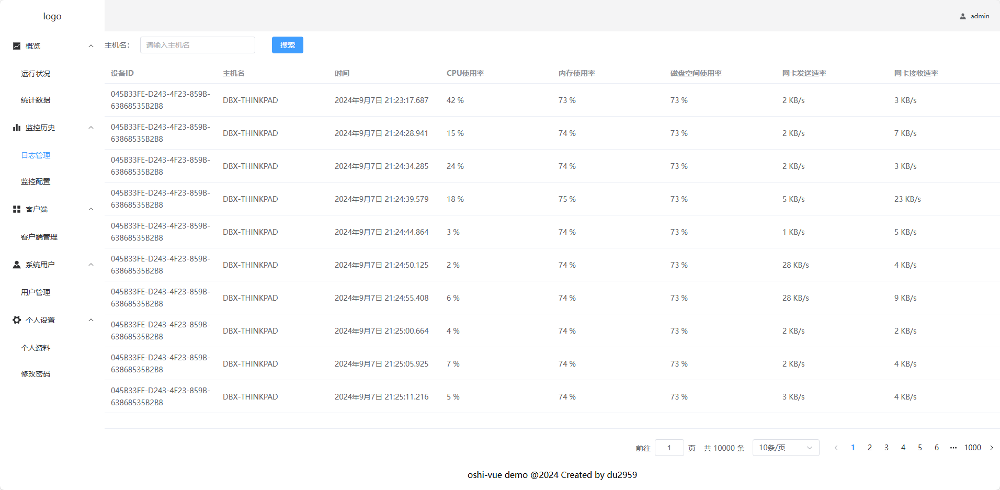
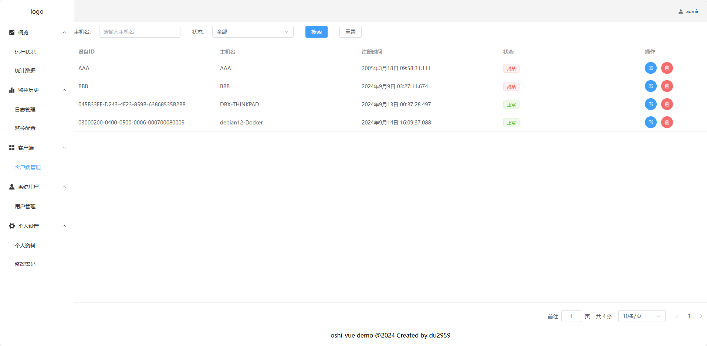
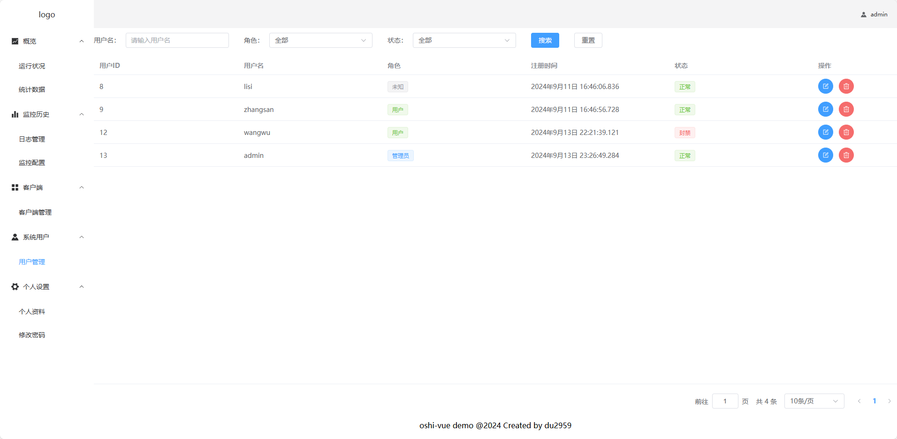

## oshi demo项目

本项目是一个用来练手的demo项目。
使用SpringBoot和SpringCloud（Alibaba）搭建，使用 [oshi](https://github.com/oshi/oshi) 库实现数据（如：CPU使用率、实时网速等）采集。

### 微服务架构

#### 网关

* 将前端请求路由到对应微服务
* 负载均衡

#### 中心服务

* 用户注册、登录、修改密码，令牌存取
* 客户端信息维护，持久化到数据库
* 客户端封禁状态缓存在Redis
* 从MQ中取客户端oshi数据，持久化到ES
* 提供客户端及oshi数据查询管理接口

#### 客户端服务

* 向中心服务注册客户端
* 查询当前客户端封禁状态，并采集oshi数据，发送到MQ

### 技术栈

* Java 17
* SpringBoot 3.2.0
* SpringCloud(Alibaba) 2023.0.0(2023.0.0.0-RC1)
* RabbitMQ 3.13
* MySQL 8
* ElasticSearch 8.15.1
* Redis

### docker

* mysql
* nacos-server
* rabbitmq:3.13-rc-management
* elasticsearch:8.15.1
* kibana:8.15.1
* redis

### 预览图

#### 日志管理

#### 客户端管理

#### 用户管理

